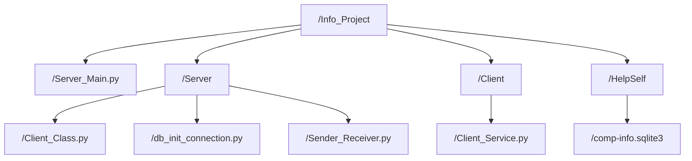
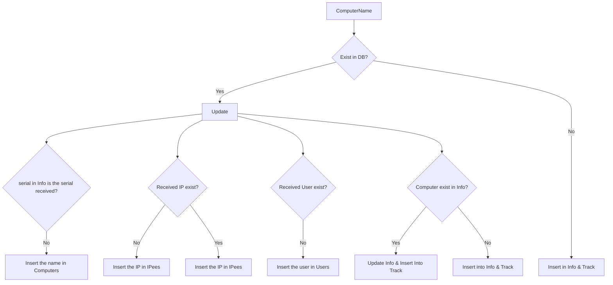
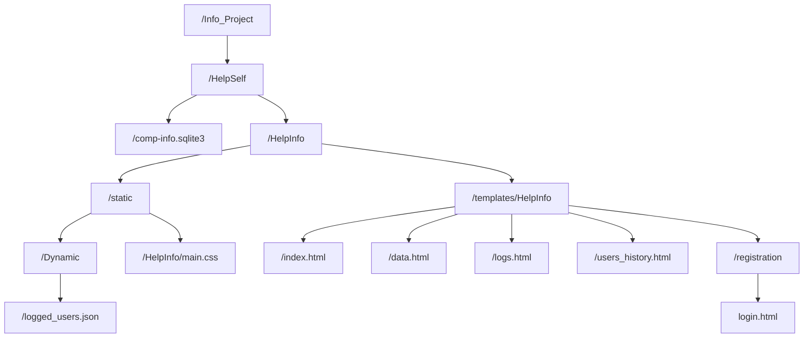
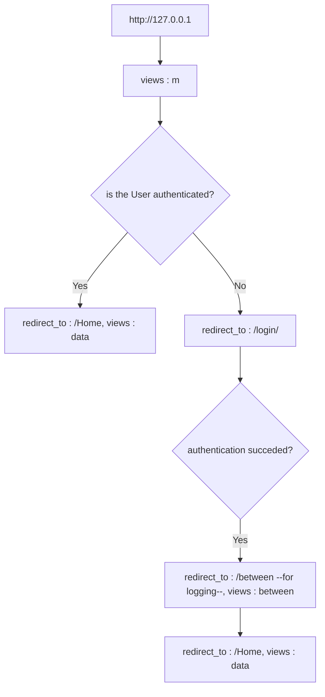

# Info_Project
The purpose of this little project is to help you when a user calls you about a problem in his computer by providing you with the necessary information to connect remotely.
Also to limit remote access to servers that might give you informations about a computer.

This project consists of two parts; the main idea is that the 1st part contains a server that receives data from clients and it stores it in a database, 
the 2nd part contains a Django app that’ll access that database and get data in order to show it in tables.

**Might work on the below stuff l8r** : 
- Still needs to be tested in restricting Environments (I tested it in a windows 10 PC with a standard user and it worked, but l8r when we pull logs too we'll have to test it again)
- Perhaps We get more data, like OS version ...
- Needs a function on Server_Main that'll change Status to 0, after 3min without a syn with a specific computer.
- Before utilization, change IP adress on client, port number if you want and create your own admin user on Django.
- changing the status field on the website to show colored indicators.
- Make the client service run silently.

## 1st part: 

**Server_Main.py** : Launch it on server  
**Client_Service** : Launch it on client side, but change the server adress that it'll connect to, according to yours.

 

**db_init_connection.py** : A bit of what happens.

## 2nd part: 

### logged Users :

At successful login we gonna take the HTTP headers and store what we want in a JSON file, 
in order to make a table of users that logged plus a few other details.

**Views** : between is the view I implemented for upon log in logging.

### Home page:
Contains current users on each computer. 
**Notice** : when you click on a row it shows you every user that has logged in to that computer !

### logged on users logs

### Users History:
it keeps track of every computer a user has logged on to and when was that exactly. 
**Notice** : when you click on a row it shows you every computer that that user has logged on to before !

