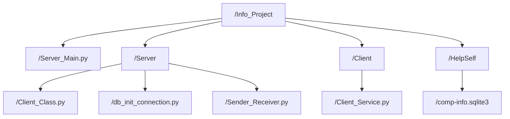
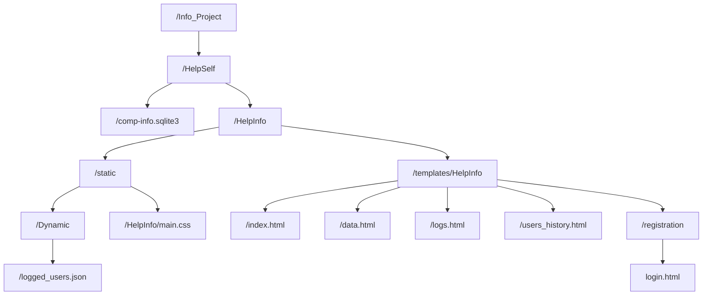

# Info_Project
The purpose of this little project is to help you when a user calls you about a problem in his computer by providing you with the necessary informtion to connect remotely
Also to limit remote access to servers that might give you informations about a computer.

This project consists of two parts; the main idea is that the 1st part contains a server that receives data from clients and it stores it in a database, 
the 2nd part contains a Django app that’ll access that database and get data in order to show it in tables.

## 1st part: 

 

## 2nd part: 

