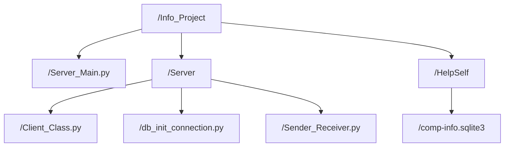

# Info_Project
The purpose of this little project is to help you when a user calls you about a problem in his computer by providing you with the necessary informtion to connect remotely
Also to limit remote access to servers that might give you informations about a computer.

This project consists of two parts; the main idea is that the 1st part contains a server that receives data from clients and it stores it in a database, 
the 2nd part contains a Django app that’ll access that database and get data in order to show it in tables.

## 1st part: 

* /Info_Project/Server_Main.py
* /Info_Project/Server/Client_Class.py
* /Info_Project/Server/db_init_connection.py
* /Info_Project/Server/Sender_Receiver.py 
* /Info_Project/HelpSelf/comp-info.sqlite3
 

## 2nd part: 

* /Info_Project/HelpSelf/comp-info.sqlite3
* /Info_Project/HelpSelf/static/Dynamic/logged_users.json

* /Info_Project/HelpSelf/static/HelpInfo/main.css
* /Info_Project/HelpSelf/templates/HelpInfo/index.html
* /Info_Project/HelpSelf/templates/HelpInfo/data.html
* /Info_Project/HelpSelf/templates/HelpInfo/logs.html
* /Info_Project/HelpSelf/templates/HelpInfo/users_history.html
* /Info_Project/HelpSelf/templates/HelpInfo/registration/login.html

